# Introduction to Git
From the learning materials you have learned that Git is a tool used for Software Version Control (SVC). This is useful for single developer projects as well as larger teams. Being able to develop and test out new features without "corrupting" the main codebase is a really useful. It is also very helpful to be able to rollback code changes that caused things to break.

For this assignment you will be getting your hands dirty and actually implement the commands you learned this week. At the end you will have a repository (repo) that has a particular structure and history. You will need to follow the instructions exactly in order for your repo to match the required output. 

This is an all or nothing activity, but don't let that scare you. At the end of this document you will find the expected structure. If you reach the end of the instructions and your repo does not match the expected output, just start over and pay close attention to the instructions.

### Create a new GitHub repo
1. Log into [github.com](https://www.github.com)
2. On the left-hand side click the "New" repo button   
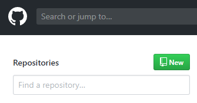  
3. Name the repo `git_intro` and click "create repository"  
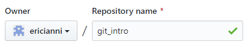  
### Create a local repo on Flip
4. Log into Flip and create a new directory called `git_intro` and navigate into it  
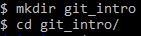  
5. Create a new Git repo by typing `git init`
6. In this folder create a file called `README.md` and put your name into it. You can do this from the command line using `echo "Eric Ianni" >> README.md`
7. Check the status of your repo by typing `git status`. You will see that `README.md` is _untracked_  
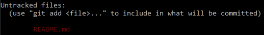  
8. In order to track, and eventually commit, `README.md` we need to _add_ it to the repo. You can do this using `git add README.md`
9. Check the status again and you will see that `README.md` is now _tracked_, but you have no commits  
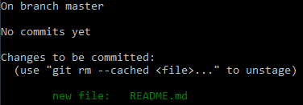  
10. Let's commit our changes by using `git commit -m "first commit"`. The `-m` tag allows us to add the commit comment inline  
### Creating a new branch
11. Now it is time to branch out. Create a new branch with `git branch featureA` and check it out with `git checkout featureA`  
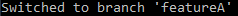
12. Using the editor of your choice, open up `README.md` and on a new line add your email address  
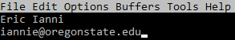  
13. Add these changes to the `featureA` branch and commit like we did before: `git add README.md` followed by `git commit -m "added email"`  
14. Let's make more changes! Open up `README.md` again and on a new line add your favorite color  
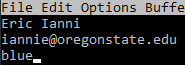  
15. Add these changes to the current branch and commit with the comment `added color`  
### Back to master
16. To fully illustrate how branches work, checkout the master branch again: `git checkout master`  
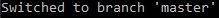
17. Now when you open `README.md` what do you see? The changes you made on `featureA` are not reflected on `master`. Go ahead and add your favorite number  
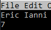  
18. Again, add these changes to the current branch with the comment `added number`  
### Creating another branch: Part Dux
19. Now create a third branch called `featureB` and check it out  
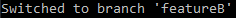  
20. As we are wont to do, open up `README.md` and on a new line add the name of your favorite band  
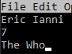  
21. Add these changes to the current branch and commit with the comment `added band`  
### Time to merge
22. Before we _merge_ let's introduce some _conflict_. Checkout the `master` branch again  
23. Open up `README.md` and _remove_ your favorite number  
24. Add these changes to the current branch with the comment `removed number`  
25. Checkout the `featureA` branch  
26. Now attempt to merge the current branch with the `featureB` branch using `git merge featureB`
27. Oh no! The merge failed due to conflicts at we must resolve  
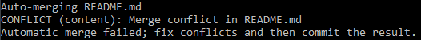  
28. In order to resolve these conflicts we need to, once again, open up `README.md` and examine them. Below is how this looks in Emacs on Flip  
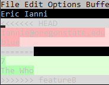  
29. The contents of `README.md` on the current branch (indicated by `HEAD`) are in red and the branch being merged are in green. Let's resolve this by keeping all the differences by removing the lines: `<<<<<<< HEAD`, `=======`, and `>>>>>>> featureB`  
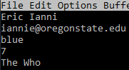  
30. If you run `git status` you will see that you are `still merging` and need to commit to finish the process  
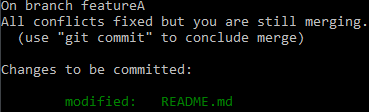  
31. Notice that `README.md` is already green so you don't need to add it before commiting. Go ahead and complete the merge by commiting with the message `merged featureA and featureB`  
### Bringing it all back to master
32. Let's bring all the branches together. Check out the `master` branch  
33. Now attempt to merge `featureA` into the current branch like we did before  
34. Darn! The merge failed again because of conflicts. Open up `README.md` and take a look  
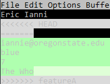  
35. This time let's keep everything _but_ the favorite number  
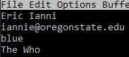  
36. Complete the merge by commiting with the message `merged master and featureA`  
### Where does this leave us?
During this assignment we have created two additional branches, each with unique changes. We have also merged all these branches back together. It can be hard to mentally picture all these changes. Luckily there is a git command to help!
37. Run `git log --graph --all` to generate a tree of your commits and merges. Yours should look like this:  
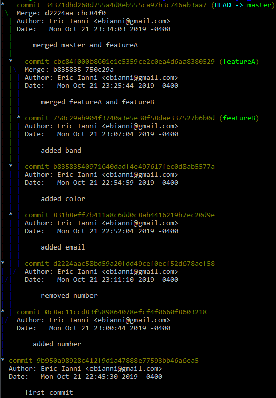  
### Pushing it to GitHub
38. Back at your new `git_intro` repo on GitHub you should see a section detailing how to push an existing repo  
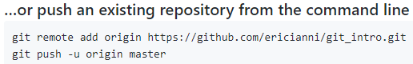  
39. On Flip, use the URL you see in your `git_intro` repo to add a remote: `git remote add origin https://github.com/ericianni/git_intro.git`  
40. _If_ we just wanted to push the current branch we would use `git push -u origin master`, but we want to push _all_ of our branches! Therefore use `git push --mirror origin`  
41. Go back to your GitHub `git_intro` repo and you will see your updated `README.md`. It will all be on one line because GitHub uses something called _markdown_ which has different syntax than you are like used to  
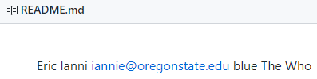  
42. Just like on the command line, GitHub has a way to visually inspect your branches and commits. Click the `Insights` tab  
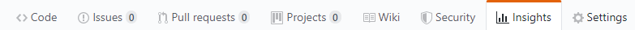  
43. To see the tree click `Network` on the left  
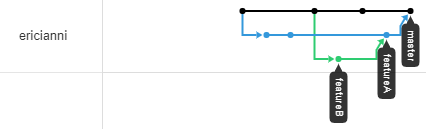__
### What to submit
For this assignment you need provide us with a link to your _public_ `git_intro` repo that matches the structure shown above.

