## Introduction
For the first portion of this course we will be using the PyCharm IDE with the EduTools plugin. This is a full-featured IDE for developing Python programs. The plugin will allow me to create for you interactive exercises to practice and familiarize yourself with the topics we discuss in the course materials. 

## Set up PyCharm Pro
For the first portion of this course we will be using the PyCharm IDE with the EduTools plugin. This is a full-featured IDE for developing Python programs. The plugin will allow me to create for you interactive exercises to practice and familiarize yourself with the topics we discuss in the course materials.

### Create Account and Download

To get started you will need a JetBrains account. As a student, you qualify for a free account, which will grant you full access to all of JetBrains' software. Please go to the [student application page](https://www.jetbrains.com/student/) to sign up with your OSU email account. 

The process should take just a few minutes and you should receive an email confirmation. Once your account is confirmed please navigate to the [download page for PyCharm Professional](https://www.jetbrains.com/pycharm/download/). Download the appropriate version of PyCharm Professional for your operating system and install.
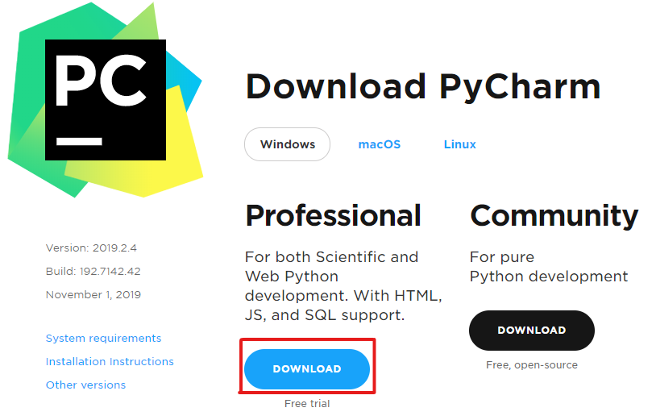

When you first run PyCharm you will be asked to customize the IDE. If you would like to select a UI Theme go ahead, but you can use the defaults for everything else. If you are prompted to enter your JetBrains account information, do so now so you can continue to use the IDE after the free trial expires.

### Install EduTools Plugin

Installing the EduTools Plugin is very easy. On the _Welcome to PyCharm_ window you see when first starting PyCharm there is a _Configure_ dropdown on the bottom right. Select this and then click on `Plugins`.  
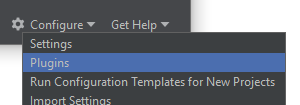

Search for `EduTools` and click _install_. At this point you will have to restart the IDE.  
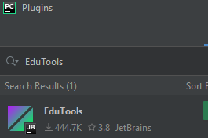

### Create Your First Project

Now it is time to create your first project.  
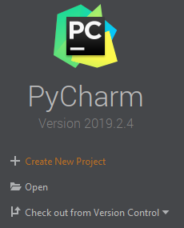  
Please select `Create New Project` and call it `example_project` and save it where ever you wish. Make sure you select the `Project Interpreter` dropdown and modify the settings. If you are using Anaconda as we discussed previously in this course, make sure you select `Conda` for the `New environment using` field. Then ensure that `Python 3.7` is selected.
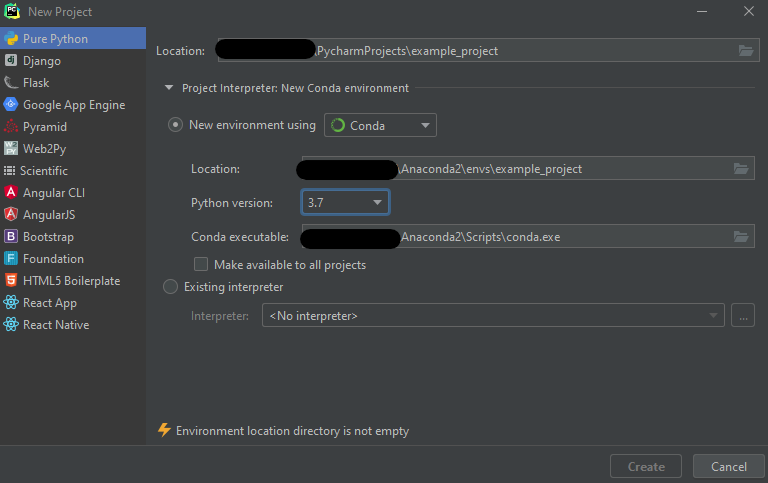

PyCharm will now set up a virtual environment to run your project in. Once it is done loading, you will see an empty IDE with a your project structure on the left hand side.  
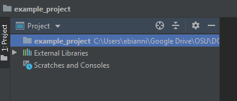

### Creat your first file

You should note that there aren't any files in your project yet! Let's change this by creating a class called `Person`. Right-click on your project folder (example_project) and select `New` and then `Python file`. When prompted, name the file `Person` and hit return.
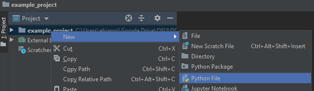

You should now see a new file listed on the left and an empty `Person.py` open on the right.
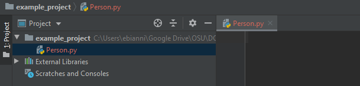

Copy the following code snippet into `Person.py` and save the changes.

```Python
class Person:
    def __init__(self, first_name="John", last_name="Doe"):
        self.first_name = first_name
        self.last_name = last_name

    def get_name(self):
        return '{0} {1}'.format(self.first_name, self.last_name)

    def set_first(self, first_name):
        self.first_name = first_name

    def set_last(self, last_name):
        self.last_name = last_name
```

This is the code we are going to be using when writing our first tests. To do this we are going to have PyCharm help us do some of the tedious work for us. 

### Create testing file

PyCharm has a feature where you can select a class and have empty tests automatically generated. To do this we simply right-click on the class name and select `Go To` and then `Test`.  
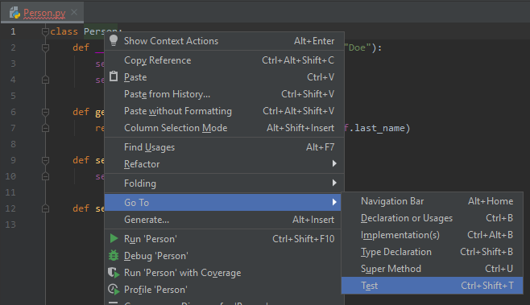

This will bring up a drop down menu that lists the current tests for the selection and the option to `Create New Test...`. Since we haven't created any tests this is the only option we have so select it.  
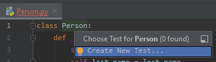

You will now see the `Create Test` dialogue box. For now the only part we want to change is checking all the listed Test Methods. PyCharm generates these methods based on the functions that the selected class contains.  
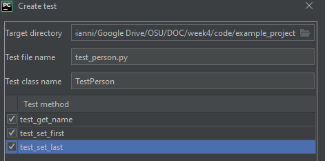

You now have the skeleton of tests for `Person`.  
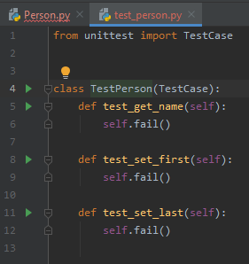

For testing purposes, please update your `test_get_name` to look like the following:
```Python
def test_get_name(self):
	my_person = Person()
	self.assertEqual(my_person.get_name(), 'John Doe', "Default parameters do not work")
```

You will also need to add `from Person import Person` just below `from unittest import TestCase`.  
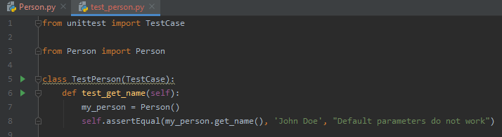

Go ahead and run these tests by right-clicking `test_person.py` and selecting `Run`.  
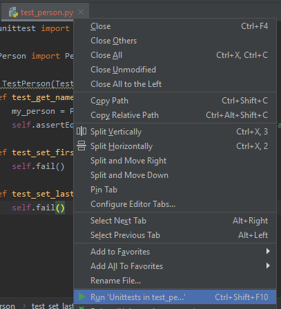

Towards the bottom of the IDE you should see the results of your most recent `Run`. You should now see where it lists the number of tests that failed and the number of tests that passed.  


Congratulations! You have successfully written your first _unit test_! You do not need to understand how `unittest` works at this point, our goal is just to get PyCharm set up and for you to learn your way around.

### Now What?

Now that your tools are all set up it is time to actually learn something about testing! Please head to the next module where you will learn about Software Testing and how you write your own tests like we did above.

## Resources

* [JetBrains PyCharm Tutorial](https://www.jetbrains.com/help/pycharm/creating-and-running-your-first-python-project.html)
* [Official Python unittest documentation](https://docs.python.org/3/library/unittest.html)


